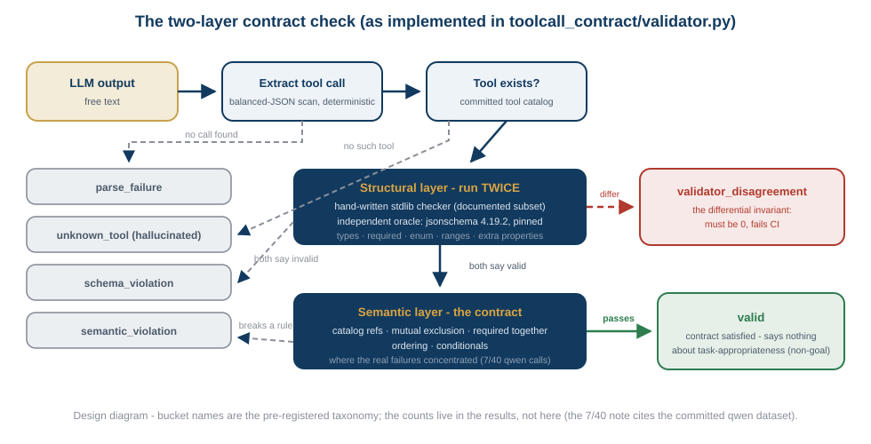
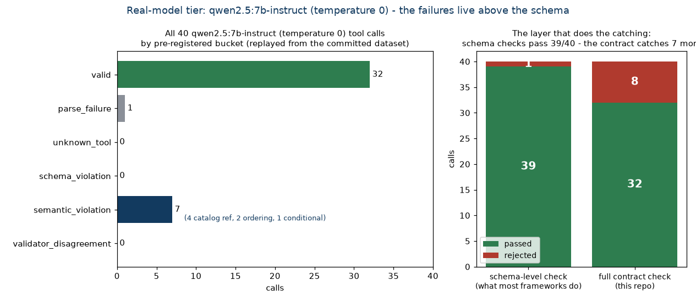

# toolcall-contract
**A deterministic two-layer validator for LLM tool calls - differentially tested against jsonschema, with the semantic layer where real failures live**

[](https://github.com/munawarkazmi/toolcall-contract/actions/workflows/ci.yml)
[](LICENSE)

LLMs emit structured tool calls that mostly look right and silently aren't,
and most agent stacks check them by eye. This repository checks them by
contract: a **structural layer** (does the call parse, name a real tool,
satisfy its JSON Schema?) that is differentially tested against a mature
independent validator, and a **semantic layer** (referential integrity
against live catalogs, mutually exclusive parameters, parameters required
together or in order, conditionals) - which is where observed tool-call
failures actually concentrate: the call that parses, types, validates, and
names a waypoint that does not exist.

It is the architecture of my
[navigation shield](https://github.com/munawarkazmi/llm-nav-shield) pointed
at the problem every agent framework has right now, built with the same
discipline: an independent oracle, pre-registered outcome buckets, committed
datasets, and load-bearing zeros that CI enforces on every push.



## The differential invariant

The validator itself is **standard-library Python with zero runtime
dependencies**. The mature [jsonschema](https://pypi.org/project/jsonschema/)
package (pinned exactly: 4.19.2) is deliberately not a dependency but the
**independent oracle**: on every structural verdict - every committed case,
every fuzzed case, every real-model call - both checkers run, and they must
agree. A disagreement is a bug in one of them, surfaced loudly, never
smoothed. That is the same role pyperplan plays in my planning benchmark and
the 4x-finer reference checker plays in the verifier. The falsifiable claim:
*agrees with jsonschema on every one of 25,000 fuzzed schema/instance pairs,
and extends it with semantic checks it cannot express.*

The structural subset is documented in
[`structural.py`](toolcall_contract/structural.py) and includes the oracle's
sharp edges, asserted by name in the tests: Python `bool` is not a number,
`1.0` is a valid `"integer"`, `True` is not a member of `enum [1]`, and
constraint keywords ignore inapplicable types.

The fuzzer is seeded and deterministic on purpose: the agreement count is
asserted in CI, and a count can only be asserted if it cannot drift.
Property-based frameworks explore brilliantly but do not promise bit-stable
generation across versions; this repository's discipline needs the promise.

## Pre-registered buckets

Committed before any dataset was evaluated
([`validator.py`](toolcall_contract/validator.py)):

| Bucket | Meaning |
| --- | --- |
| `valid` | parses, names a real tool, passes both layers |
| `parse_failure` | no `{"tool": ..., "arguments": {...}}` object extractable |
| `unknown_tool` | names a tool that does not exist (the hallucinated tool) |
| `schema_violation` | structural: missing required, wrong type, bad enum, extra property, out of range |
| `semantic_violation` | structurally valid; breaks a declared contract rule |
| `validator_disagreement` | **load-bearing:** ours vs jsonschema differ on structure - must be 0 |
| `invalid_marked_valid` | **load-bearing:** a constructed-invalid call passed - must be 0 |

Two axes the validator deliberately never merges: structural and semantic
validity are reported separately (the bucket names which layer failed), and
**task-appropriateness is a stated non-goal** - whether the call was the
right tool for the user's goal is a different axis the contract cannot see,
exactly as the shield checks safety, not optimality.

## The two tiers

**Tier one - constructed, zero inference, CI-enforced forever.** A seeded
generator builds valid and invalid-by-construction calls against the
committed [tool catalog](tools_catalog/tools.json), one class per bucket,
every label confirmed against the oracle before it is written. CI
regenerates the dataset and diffs it against the committed file.

The catalog: eight robot-operations tools, each carrying the contract rules
its schema does not:

| Tool | Semantic contract |
| --- | --- |
| `navigate_to_waypoint` | waypoint and every avoid-zone must exist in the catalogs |
| `pick_object` / `place_object` | object (and waypoint) must exist |
| `set_speed_limit` | `scope: "zone"` requires a `zone`; `"global"` forbids one |
| `schedule_task` | `start_time` must not exceed `end_time` |
| `query_map` | (schema-only - the control case) |
| `grasp_handoff` | `person_id` and `waypoint` are mutually exclusive; both must exist |
| `report_status` | geofence corners required together, and ordered |

**Tier two - real model, zero inference at evaluation time.** The committed
task set ([`datasets/tasks.json`](datasets/tasks.json), forty natural
robot-operations requests - some referencing entities that do not exist,
because real user requests do) is run once against a named local model; the
raw prompt/response pairs are committed, and evaluation replays them
deterministically. The bucket distribution is the finding, worded as a fact
about that model at those settings.

## Results

Verbatim tool output, committed under [reports/](reports/).

**The differential invariant** (`tools/fuzz_differential.py`):

```text
fuzz: 25000 schema/instance pairs, ours vs jsonschema 4.19.2: 25000 agreements, 0 disagreements
PASS: full structural agreement with the independent oracle
```

**Tier one - constructed** (262 cases, every label oracle-confirmed):

```text
  valid                80
  parse_failure        24
  unknown_tool         30
  schema_violation     60
  semantic_violation   68
  validator_disagreement 0   <-- load-bearing; must be 0
  invalid_marked_valid   0   <-- load-bearing; must be 0
  other bucket mismatches 0   (constructed labels must match exactly)
```

**Tier two - real models.** The same forty tasks, one call each, raw
responses committed, every evaluation replayed deterministically in CI.
First `qwen2.5:7b-instruct` (temperature 0, served locally by Ollama):

```text
model under evaluation: qwen2.5:7b-instruct (temperature 0)
  valid                32
  parse_failure        1
  unknown_tool         0
  schema_violation     0
  semantic_violation   7
  validator_disagreement 0   <-- load-bearing; must be 0
```



([tools/render_figures.py](tools/render_figures.py) renders this by
replaying the committed dataset through the validator - the same replay CI
runs, so the figure cannot diverge from the evaluation.)

Reading it precisely - facts about one 7B model at one temperature on n=40:

- **The structural layer alone would have passed 39 of 40 calls.** qwen
  never hallucinated a tool name and never violated a schema - the checks
  most agent frameworks stop at caught almost nothing.
- **All the substance was semantic: 7 of 40 calls (17.5%) were schema-valid
  contract violations** - four faithful transcriptions of nonexistent
  entities into well-typed calls (`green_cylinder`, `workbench`,
  `operator_5`, `lava_zone`), two copied-contradiction ordering violations
  (a delivery ending before it starts; a geofence from 9.0 down to 1.0), and
  one conditional violation (`scope: "zone"` with no zone). This is the
  thesis in data: real tool-call failures live above the schema.
- The one `parse_failure` is itself interesting: asked to rotate a camera it
  has no tool for, the model emitted `{}` rather than hallucinating a tool.
- **And the honest boundary, on display** ([tools/inspect_failures.py](tools/inspect_failures.py)
  prints all of this from committed data): several impossible requests were
  *silently substituted* into contract-valid calls - "warehouse 3" became
  `storage_a`, "5 m/s" became `0.5`, "turn the robot off" became a status
  report, 100 N of grip force was silently clamped to the schema maximum.
  All of these land in `valid`, because they satisfy the contract. Whether a
  call matches the user's *intent* is the task-appropriateness axis this
  validator pre-declared as a non-goal - these cases are why that axis
  exists, and why merging the two into one "valid" score would be a lie.
  Catching silent substitution needs intent-grounding machinery, not a
  stricter contract.

**The same forty tasks against a second model.**
`llama-3.3-70b-versatile` (temperature 0, hosted by Groq), collected with
the same script over a hosted endpoint:

```text
model under evaluation: llama-3.3-70b-versatile (temperature 0)
llama-3.3-70b-versatile.jsonl: 40 cases
  valid                34
  parse_failure        1
  unknown_tool         0
  schema_violation     0
  semantic_violation   5
  validator_disagreement 0   <-- load-bearing; must be 0
```

Per model, side by side - counts on the same n=40, never averaged into
"LLMs":

| bucket | qwen2.5:7b-instruct | llama-3.3-70b-versatile |
|---|---|---|
| valid | 32 | 34 |
| parse_failure | 1 | 1 |
| unknown_tool | 0 | 0 |
| schema_violation | 0 | 0 |
| semantic_violation | 7 | 5 |
| validator_disagreement | 0 | 0 |

Reading the replication precisely:

- **The thesis survives its first replication: at ten times the parameters,
  the structural layer alone would again have passed 39 of 40 calls.**
  llama hallucinated no tool names and broke no schemas; every substantive
  failure was again a schema-valid contract violation.
- Its five semantic violations are the same three families qwen showed:
  three faithful transcriptions of nonexistent entities into well-typed
  calls (`green_cylinder`, `operator_5`, `lava_zone`), one
  copied-contradiction ordering violation (a delivery ending at second 300
  that starts at second 900), and one dangling conditional
  (`scope: "zone"` with no zone). The 70B model stepped past two traps the
  7B took (`workbench`, the descending geofence) - fewer entity errors,
  identical failure kinds.
- Both models' single `parse_failure` is the *same task*: asked to rotate
  a camera no tool controls, qwen emitted `{}` and llama wrote a prose
  refusal naming the missing capability. Neither hallucinated a tool -
  the most honest failure in either dataset, landing in the one bucket
  built for it.

## Plain-language guide

For a non-specialist reader there is a five-page guide,
[docs/explainer/explainer.pdf](docs/explainer/explainer.pdf), which explains
what a tool call is, quotes the real well-formed-and-wrong calls from the
committed datasets, and sets out the silent-substitution boundary this
validator declares rather than scores across. Its source is committed
alongside it and builds with `latexmk -pdf explainer.tex`.

## Reproduce

```bash
git clone https://github.com/munawarkazmi/toolcall-contract.git
cd toolcall-contract
pip install pytest jsonschema==4.19.2
python -m pytest -q tests/                          # oracle edges, buckets
python tools/gen_constructed.py /tmp/regen.jsonl    # dataset regeneration
diff datasets/constructed.jsonl /tmp/regen.jsonl
python tools/evaluate.py datasets/constructed.jsonl # both load-bearing zeros
python tools/fuzz_differential.py                   # 25,000-pair differential
python tools/evaluate.py datasets/qwen2.5-7b-instruct.jsonl      # qwen tier
python tools/evaluate.py datasets/llama-3.3-70b-versatile.jsonl  # llama tier
```

Collection (`tools/collect_qwen.py`) needs any OpenAI-compatible endpoint -
local Ollama by default, hosted endpoints via `--api-key-env` and
`--min-interval-s`; evaluation of the committed data needs none.

## License

MIT, Munawar Kazmi.
